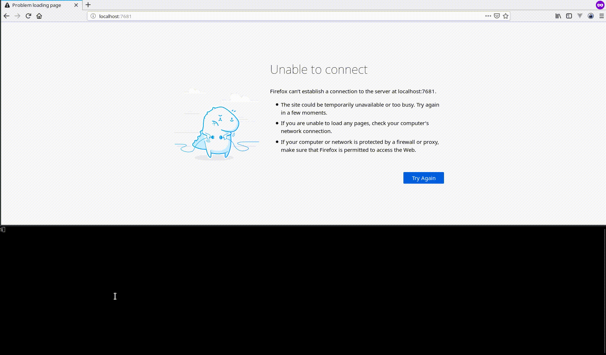

# TurtleCoin zedwallet With TTYD Docker Image

This image pulls the binary from the base image and runs zedwallet on apline using ttyd. ttyd allows you to interact with zedwallet via a browser. The process is run within tmux to persist the session in case the page reloads or crashes.



## Table of Contents
1. [Examples](#examples)
2. [Build Args/Env Variables](#build-arguments-and-environment-variables)

## Examples:
```
docker build -t zedwallet-ttyd .
docker run -d -p 7681:7681 --name zedwallet-ttyd -v zedwallet:/home/turtlecoin/ zedwallet-ttyd
```

To use zedwallet navigate to http://localhost:7681 (or whatever port you pass in, e.g. ```-p 8080:7681```)

Using a remote node
```
docker build -t zedwallet-ttyd .
docker run -d -p 7681:7681 -e REMOTE_DAEMON_HOST=my-favorite-node.lol -e REMOTE_DAEMON_PORT=11898 -v zedwallet:/home/turtlecoin/ --name zedwallet-ttyd zedwallet-ttyd
```

Running with a bind mount:

```
docker build -t zedwallet-ttyd .
docker run -d -p 7681:7681 --name zedwallet-ttyd -v ${PWD}/zedwallet:/home/turtlecoin/ zedwallet-ttyd
```

Accessing the web terminal with a username and password:
```
docker run -d -p 7681:7681 -e WEB_USERNAME=Slow -e WEB_PASSWORD=AndSteady --name zedwallet-ttyd -v zedwallet:/home/turtlecoin/ zedwallet-ttyd
```

This image is also hosted on [Docker Hub](https://hub.docker.com/r/andrewnk/turtlecoin).

To run from the Docker Hub image:

```
docker run -d -p 7681:7681 --name zedwallet-ttyd -v zedwallet:/home/turtlecoin/ andrewnk/turtlecoin:zedwallet-ttyd
```

To use from the Docker Hub image:

```
FROM andrewnk/turtlecoin:zedwallet-ttyd as zedwallet-ttyd
```
## Build Arguments and Environment Variables:

| Name | Default | Function |
| --- | --- | --- |
| REMOTE_DAEMON_HOST | | If using a remote node, used to set the remote node host |
| REMOTE_DAEMON_PORT | | If using a remote node, used to set the remote node port |
| WEB_USERNAME |  | Username to access the web terminal |
| WEB_PASSWORD |  | Password to access the web terminal |
